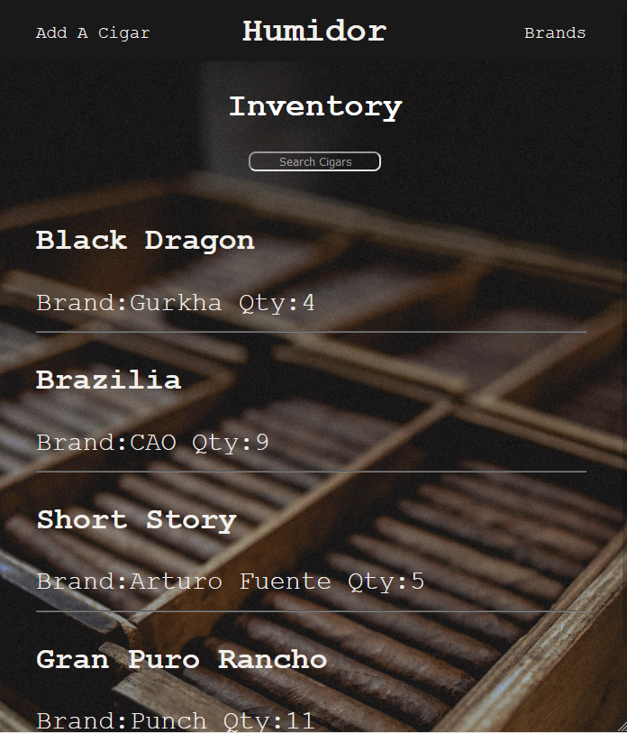
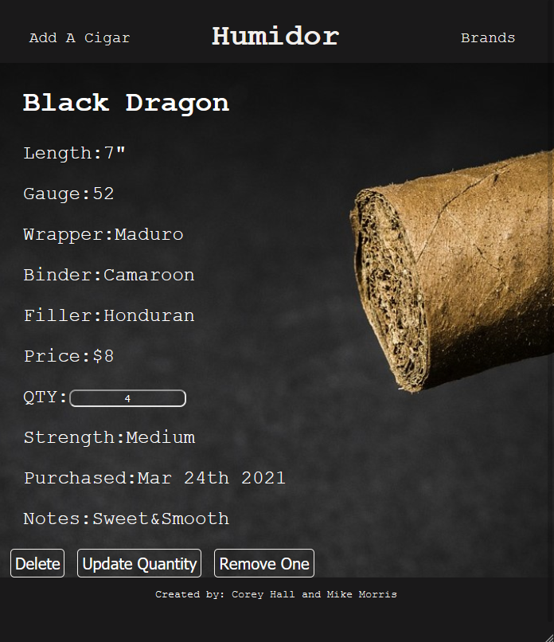
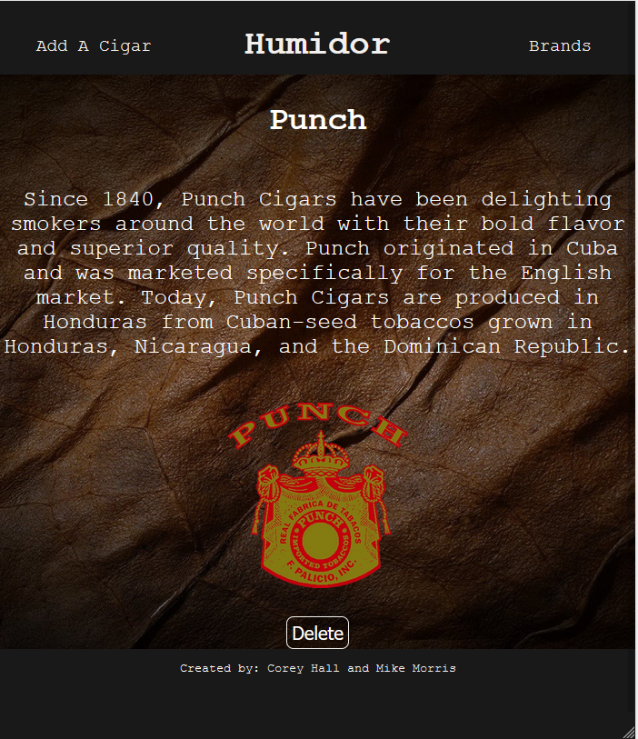

# [Humidor](https://humidor-app.herokuapp.com/)

Humidor was a capstone collaboration project between [Mike Morris](https://github.com/Grady828) and [Corey Hall](https://github.com/Chall008). This application was a brain child of Mike and his affinity for cigars. Together, we created an application that could create, read, update, and delete (CRUD) the contents of a humidor. We used C# to create the backend, made our own API database, HTML/CSS and Javascript/REACT to bring the Front-End together.

Features included:

1. Adding a cigar.
   
   The user is able to insert the information of their favorite cigar and select a brand and submit. This will then direct you to the Inventory page.

2. Deleting, Updating Stock, & Removing 1 Cigar.
   
   Here you can see the information for an individual cigar.

3. Creating a Brand and Inserting a Picture.
   
   While at this page, you can add a new brand while adding your favorite picture.

4. View Specific Brands
   
   After scrolling through the brands page the user is able to select any brand they want. The user is then directed the brands information page which gives you the option to delete the brand as well.

Incase you missed the link at the top, here is the [live link](https://humidor-app.herokuapp.com/) of Humidor. Thanks for checking it out!

Corey & Mike
